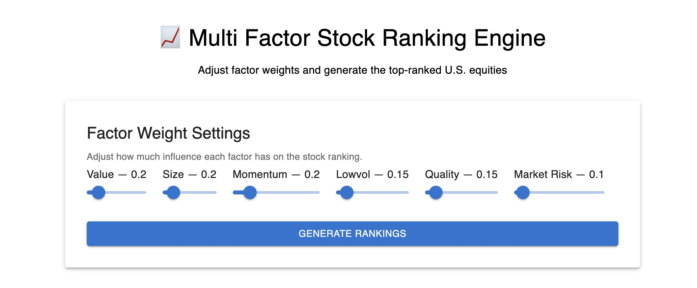

# Multi-Factor Stock Ranking Engine



## Overview
This project is a factor-based stock ranking system that ranks large-cap US equities (S&P 500) using well-established investment factors.

Stocks are scored across six factors (Value, Size, Momentum, Low Volatility, Quality, Market Risk). Users can assign a custom weight to each factor which is then used to produce a list of top-N stocks based on the composite score.

This project focuses on stock ranking rather than portfolio optimization or backtesting.
## Background: Factor Investing

Factor investing is a strategy that involves investing in stocks with certain attributes that have been proven to deliver higher risk-adjusted returns than the market.

Extensive academic research on historical market data has shown that certain characteristics can be associated with increased excess returns. This forms the basis for factor investing.

Rather than selecting stocks based on predictions, factor investing evaluates securities based on these attributes or "Factors".

For a factor to qualify as investable it must be <b>performing, proven, persistent, explainable and executable.</b>

Using this concept, this project aims to rank stocks based on cross-sectional factor scores.

## Factors Used in This Project

This project evaluates stocks on the basis of the following six commonly researched factors:

<details>

<summary><b>Value</b></summary>

Stocks that are inexpensive relative to their fundamentals tend to outperform.

Signals used:
- Book to Market Ratio
- Earning to Price Ratio 
- Cashflow to Price Ratio
- Sales to Price Ratio
  
</details>

<details>

<summary><b>Size</b></summary>

Smaller-cap companies have historically exhibited higher returns than larger companies.

Signals used:
- Negative log of market capitalization
  
</details>

<details>

<summary><b>Momentum</b></summary>

Stocks with strong recent price performance tend to continue outperforming.

Signals used:
- 12-month Momentum
- 6-month Momentum
- 3-month Momentum
  
</details>

<details>

<summary><b>Low Volatility</b></summary>

Stocks with lower volatility have historically delivered greater returns with lower drawdown. 

Signals used:
- 252-day Volatility
- 180-day Volatility
  
</details>

<details>

<summary><b>Quality</b></summary>

Companies with strong profitability and solid balance sheets tend to outperform over time.

Signals used:
- Return on Equity (ROE)
- Gross Profitability
- Profit Margins
- Leverage
  
</details>

<details>

<summary><b>Market-Risk</b></summary>

Lower exposure to  market (systematic) has been associated with greater and more stable returns.

Signals used:
- Beta
  
</details>

## Key Features
- **Multi-factor stock ranking model** based on academic research
- **Multi-signal factor score evaluation** for accurate scoring
- **Sector-neutral z-scoring** to avoid sector bias
- **Outlier clipping (winsorization)** for robust factor signals
- **Multiple Cached data layer** for fast re-runs
- **Multithreaded data fetching** for faster startup
- **FastAPI backend** with clean REST endpoints
- **Interactive React frontend** for real-time ranking
- **Docker Compose setup** for running frontend and backend together


## System Architecture
### Backend:
- Python + FastAPI
- Modular data pipeline
  - Fetch → Clean → Cache → Compute → Rank
- Easily extensible for new factors or universes.

### Frontend:
- React + Material UI
- Factor weight sliders
- Ranked Stock Table (Top 20)
- Communicates with backend via FastAPI

## Project Structure
```
Multi-Factor-Stock-Ranking-Engine/
│
├── backend/
│   ├── Dockerfile
│   │   # Backend container definition
│   │
│   ├── requirements.txt
│   │   # Python backend dependencies
│   │
│   ├── api/
│   │   └── main.py
│   │       # FastAPI entry point and REST endpoints
│   │
│   ├── data/
│   │   ├── fetcher.py
│   │   │   # Raw data retrieval from yfinance
│   │   ├── cleaner.py
│   │   │   # Data cleaning and normalization utilities
│   │   ├── provider.py
│   │   │   # Unified interface for fetch → clean → cache logic
│   │   ├── universe.py
│   │   │   # S&P 500 universe loading
│   │   └── sp_500.csv
│   │       # Base universe file
│   │
│   ├── data_store/
│   │   └── storage.py
│   │       # Local on-disk caching utilities
│   │
│   ├── fundamentals/
│   │   └── fundamental_calculator.py
│   │       # Fundamental metric calculations
│   │
│   ├── metrics/
│   │   └── metric_builder.py
│   │       # Derived metric cache construction
│   │
│   ├── factors/
│   │   └── factor_model.py
│   │       # Factor construction, winsorization, sector z-scoring
│   │
│   ├── ranking/
│   │   └── ranking_engine.py
│   │       # Composite scoring, normalization, ranking logic
│   │
│   └── __init__.py
│
├── frontend/
│   ├── Dockerfile
│   │   # Frontend container definition
│   │
│   ├── public/
│   │   └── index.html
│   │
│   ├── src/
│   │   ├── App.js
│   │   │   # Main UI container
│   │   ├── FactorWeightSliders.js
│   │   │   # Factor weight controls
│   │   ├── index.js
│   │   │   # React entry point
│   │   ├── App.css
│   │   └── index.css
│   │
│   ├── package.json
│   ├── package-lock.json
│   └── .dockerignore
│
├── data_store/
│   # Local stock data cache generated at runtime
│
├── docker-compose.yml
│   # Runs backend and frontend together
│
├── .dockerignore
├── .gitignore
├── README.md
└── LICENSE
```

## Setup and Running Instructions

### Option 1: Run with Docker Compose (Recommended)

This is the simplest way to run the full application. It starts both the FastAPI backend and React frontend together.

#### 1. Clone the repository
```bash
git clone https://github.com/prakhar2k06/Multi-Factor-Stock-Ranking-Engine.git
cd Multi-Factor-Stock-Ranking-Engine
```

#### 2. Build and start the application
```bash
docker compose up --build
```

Once the containers are running, open:

```
Frontend: http://localhost:3000
Backend API docs: http://localhost:8000/docs
```

The backend may take a few minutes to finish loading cached factor data. Wait until the backend logs show:

```
INFO:     Application startup complete.
```

To stop the application, press `Ctrl+C` in the terminal running Docker Compose.

#### Notes on Docker

- The backend runs on port `8000`.
- The frontend runs on port `3000`.
- The local `data_store/` directory is used for cached market data and derived metrics.
- First startup may take longer if the cache is missing and market data needs to be fetched.
- Subsequent runs are faster because raw data and derived metrics are cached locally.

---

### Option 2: Run Manually Without Docker

#### 1. Clone the repository
```bash
git clone https://github.com/prakhar2k06/Multi-Factor-Stock-Ranking-Engine.git
cd Multi-Factor-Stock-Ranking-Engine
```

#### 2. Backend Setup (FastAPI)

Create and activate a virtual environment:

```bash
python3 -m venv .venv
source .venv/bin/activate      # macOS / Linux
# .venv\Scripts\activate       # Windows
```

Install backend dependencies:

```bash
pip install -r backend/requirements.txt
```

Start the backend server from the project root:

```bash
uvicorn backend.api.main:app --reload
```

If successful, you should see:

```
Uvicorn running on http://127.0.0.1:8000
```

Please wait until you see this before sending requests (this could take 3 to 4 minutes):

```
INFO:     Application startup complete.
```

#### 3. Frontend Setup (React)

In a separate terminal, navigate to the frontend directory:

```bash
cd frontend
```

Install frontend dependencies:

```bash
npm install
```

Start the frontend:

```bash
npm start
```

This will launch the frontend at:

```
http://localhost:3000
```

## API Endpoints
### Retrieve Raw Factor Scores
```
GET /factors
```
### Rank Stocks (POST)
```
POST /rank
```
Example Request Body
```
{
  "value": 0.2,
  "size": 0.2,
  "momentum": 0.2,
  "lowvol": 0.15,
  "quality": 0.15,
  "market_risk": 0.1
}

```

## Future Improvements
- Portfolio Construction and weighting
- Additional Factors
- Backend health/readiness endpoints

## License

This project is licensed under the MIT License.

## Disclaimer

This project is for educational and research purposes only and does not constitute investment advice.


## Disclaimer

This project is for educational and research purposes only and does not constitute investment advice.

